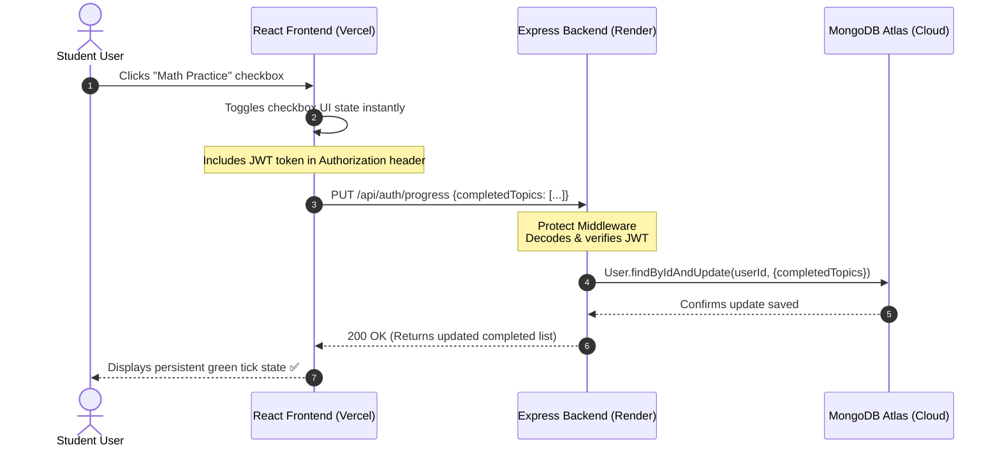
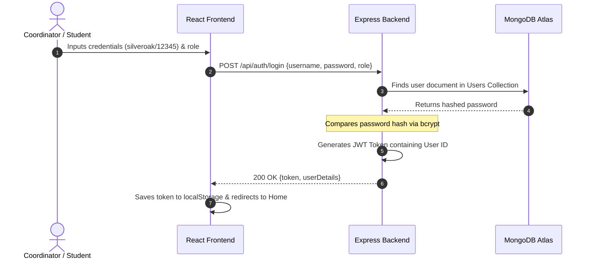

# 📚 Syllabus Checkbox - MERN Full Stack App

This project is a MERN (MongoDB, Express, React, Node.js) full-stack application. It features a modern React interface styled with custom Glassmorphism components, secure JWT-based authentication, and a MongoDB-connected REST API for real-time progress syncing, syllabus updates, and class file sharing.

---

## 🌐 How the Web App Works (Architecture & Data Flow)

Understanding how a full-stack web application operates is essential. Below are the architectural workflows and request-response cycles that power this application.

### 1. High-Level Architecture Diagram
This diagram shows how the frontend (client), backend (server), and database (cloud data store) connect and communicate with each other:

```mermaid
graph TD
    subgraph Client Layer (Vercel)
        A[React Router SPA] -->|Renders UI| B(Vite Client App)
        B -->|Saves JWT Token| C[(Browser LocalStorage)]
    end

    subgraph Server Layer (Render)
        D{Express Router} -->|Validates Token| E[Auth Middleware]
        E -->|Processes API Request| F[API Controllers]
        F -->|Handles Uploads| G[Multer Storage]
    end

    subgraph Database Layer (MongoDB Atlas)
        H[(MongoDB Cloud DB)] <-->|Mongoose Schemas| F
    end

    B <-->|HTTP REST Requests & JWT| D
```

---

### 2. Checkbox Progress Sync Workflow (Sequence Diagram)
When a student checks a topic checkbox (e.g. "Math Practice"), the progress is synchronized to their profile in the database. Here is the step-by-step cycle:



---

### 3. JWT Authentication & Login Flow
Here is how secure sessions are established and verified without storing raw passwords:



---

## 📂 Folder Structure

- `/backend`: Node.js & Express server, Mongoose models, and upload middleware.
- `/frontend`: React & Vite application with a premium HSL design system.
- `/legacy`: Backups of the original HTML, JS, and CSS files.

---

## 🛠️ Prerequisites

1. **Node.js**: Install Node.js (v18+ recommended).
2. **MongoDB**: Connects to the hosted cloud database cluster on MongoDB Atlas. You can configure the URI in `backend/.env`.

---

## 🚀 Getting Started (Local Run)

1. **Install Dependencies** (Root, Backend, and Frontend):
   Run the following command at the root directory of the project:
   ```bash
   npm run install-all
   ```

2. **Run the Application** (in development mode):
   Run the following command at the root directory of the project:
   ```bash
   npm run dev
   ```
   This will concurrently spin up:
   - The Express backend on `http://localhost:5000`
   - The React dev server on `http://localhost:5173`

3. **Open the browser**:
   Navigate to `http://localhost:5173` to access the application.

---

## 🔒 Seed Credentials

Upon database connection, the application automatically seeds two default accounts if they do not exist in your MongoDB:
1. **Class Coordinator**:
   - **Username**: `silveroak`
   - **Password**: `12345`
2. **Student**:
   - **Username**: `rajveer`
   - **Password**: `12345`

*Note: You can also use the **Register** tab on the login screen to sign up with custom credentials.*
